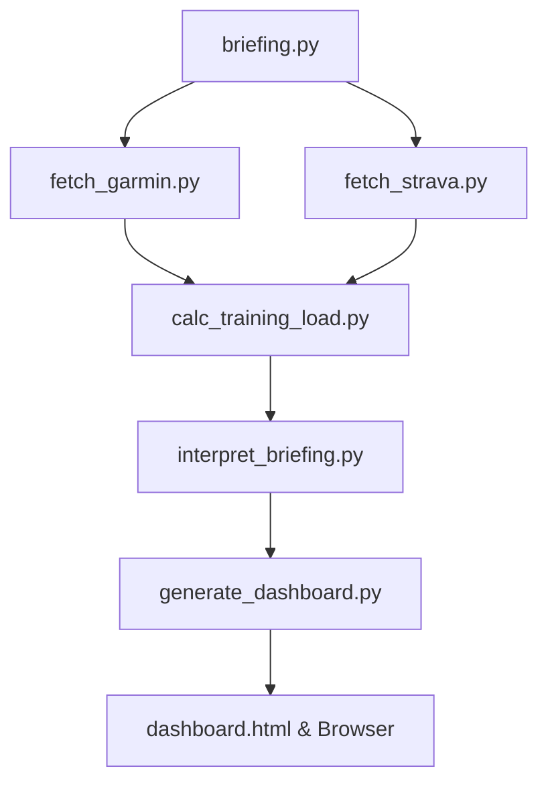

# FitCoach: Garmin & Strava Daily Briefing

O **FitCoach** é um assistente pessoal de treinamento e fisiologia esportiva. Ele coleta dados diários de saúde, sono e prontidão do **Garmin Connect** e consolida com o histórico de atividades do **Strava** (incluindo treinos virtuais de plataformas como o MyWhoosh). 

Com base nessas informações, o sistema calcula métricas avançadas de carga de treino (**TRIMP** e **ACWR**), analisa a resposta fisiológica usando a **API do Google Gemini** (com um fallback determinístico local) e gera um **Dashboard interativo em HTML** com o briefing diário e recomendações acionáveis para o seu dia de treino.

---

## 🚀 Funcionalidades

- **Coleta Automatizada**: Integração com as APIs do Garmin Connect e Strava para buscar métricas diárias de sono, HRV, Training Readiness, peso, VO2 Max, previsões de prova e atividades recentes.
- **Cálculo Fisiológico Avançado**:
  - **TRIMP (Training Impulse)**: Medição da intensidade/volume do treino baseada em frequência cardíaca e potência (FTP/LTHR).
  - **ACWR (Acute:Chronic Workload Ratio)**: Razão entre a carga aguda (fadiga dos últimos 7 dias) e a carga crônica (aptidão dos últimos 28 dias) para prever o risco de lesões.
- **Deduplicação Inteligente**: Mescla atividades do Garmin e Strava de forma inteligente, evitando duplicar registros de treinos sincronizados em ambas as plataformas.
- **Interpretação por Inteligência Artificial**: Utiliza o modelo `gemini-2.5-flash` para analisar a saúde física, a tendência de carga e sugerir a melhor ação do dia (ex: treino intervalado, rodagem regenerativa ou descanso total).
- **Dashboard Premium**: Interface moderna em HTML, medidores visuais de ACWR (zonas ideal, cautela e perigo), acompanhamento de VO2 Max, histórico de sono e filtros temporais.

---

## 🛠️ Arquitetura do Projeto

O fluxo de execução é orquestrado de forma sequencial pelo script `briefing.py`:



1. **Camada de Coleta (Layer 1a & 1b)**: `fetch_garmin.py` e `fetch_strava.py` buscam dados brutos e salvam em cache local.
2. **Camada de Cálculo (Layer 1c)**: `calc_training_load.py` calcula o TRIMP e a relação ACWR combinada.
3. **Camada de Inteligência (Layer 2)**: `interpret_briefing.py` envia o JSON consolidado ao Gemini (ou aplica regras locais se a API Key não estiver disponível) e gera o arquivo `briefing.md`.
4. **Camada de Visualização (Layer 3)**: `generate_dashboard.py` formata os dados e injeta o briefing gerado em um painel HTML dinâmico (`dashboard.html`), abrindo-o automaticamente no navegador.

---

## 📦 Instalação e Pré-requisitos

1. **Clone o repositório:**
   ```bash
   git clone https://github.com/brunolinsalves/fitcoach.git
   cd fitcoach
   ```

2. **Crie e ative um ambiente virtual (recomendado):**
   ```bash
   python3 -m venv .venv
   source .venv/bin/activate  # No Linux/macOS
   # ou
   .venv\Scripts\activate          # No Windows
   ```

3. **Instale as dependências:**
   ```bash
   pip install -r requirements.txt
   ```

---

## ⚙️ Configuração (.env)

Crie um arquivo `.env` na raiz do projeto (use o `.env.example` como base):

```bash
cp .env.example .env
```

Abra o `.env` e preencha as variáveis de configuração:

### 1. Credenciais Garmin
- `GARMIN_EMAIL`: Seu e-mail do Garmin Connect.
- `GARMIN_PASSWORD`: Sua senha do Garmin Connect.
- `GARMINTOKENS`: Diretório para salvar os tokens de sessão (`.garminconnect` por padrão) para evitar múltiplos logins e bloqueios de limite de taxa (rate limits).

### 2. Chave da API Gemini (Opcional)
- `GEMINI_API_KEY`: Sua chave de API da Google AI Studio. Se não for informada, o sistema usará um algoritmo heurístico determinístico local para gerar as recomendações diárias.

### 3. Integração com o Strava (Opcional)
Para buscar treinos externos (como MyWhoosh ou Zwift sincronizados no Strava):
- Crie um aplicativo na página de [Configurações de API do Strava](https://www.strava.com/settings/api).
- Configure a URL de callback para `http://localhost:5000/callback`.
- Copie e configure as chaves `STRAVA_CLIENT_ID` e `STRAVA_CLIENT_SECRET`.

### 4. Parâmetros Fisiológicos Individuais
Essenciais para o cálculo correto do TRIMP e zonas de intensidade:
- `MAX_HR`: Frequência cardíaca máxima (ex: `189`).
- `RESTING_HR`: Frequência cardíaca em repouso de referência (ex: `50`).
- `CYCLING_FTP`: FTP de ciclismo em Watts (ex: `178`).
- `RUNNING_LTHR`: Frequência cardíaca no Limiar de Lactato para corrida (ex: `168`).
- `SWIM_PACE`: Ritmo médio para 100m de natação (formato `M:SS`, ex: `2:00`).
- `RUNNING_ECONOMY_PENALTY`: Fator de penalidade para corrida (ex: `0.10`).

### 5. Envio por E-mail (Opcional)
Se desejar enviar o dashboard HTML por e-mail automaticamente a cada execução:
- `SEND_EMAIL`: Define se envia o e-mail (`true` ou `false`).
- `SMTP_SERVER`: Servidor SMTP de saída (pré-configurado para Gmail: `smtp.gmail.com`).
- `SMTP_PORT`: Porta SMTP (geralmente `587` com TLS ou `465` com SSL. Gmail usa `587`).
- `SMTP_USERNAME`: Usuário do e-mail de envio (ex: `seu-email@gmail.com`).
- `SMTP_PASSWORD`: Senha de autenticação.
  > [!IMPORTANT]
  > Se você utiliza o **Gmail**, não utilize sua senha padrão. Por questões de segurança e políticas do Google, você deve gerar uma **Senha de App** no link [Google App Passwords](https://myaccount.google.com/apppasswords) e preenchê-la aqui.
- `EMAIL_TO`: E-mail de destino (ex: `seu-email@gmail.com`).
- `EMAIL_FROM`: E-mail de origem (ex: `seu-email@gmail.com`).

---

## 🚀 Como Executar

O projeto possui um único orquestrador central. Para rodar o fluxo completo de sincronização e abrir o dashboard:

```bash
python briefing.py
```

### Argumentos Úteis
- **Usar cache local** (evita chamadas às APIs do Garmin e Strava se você já rodou hoje):
  ```bash
  python briefing.py --cached
  ```
- **Ignorar dados do Strava** (usa apenas os dados diretos do Garmin):
  ```bash
  python briefing.py --no-strava
  ```
- **Coletar uma data específica** (formato YYYY-MM-DD):
  ```bash
  python briefing.py --date 2026-06-17
  ```
- **Definir arquivo de saída personalizado**:
  ```bash
  python briefing.py --output meu_treino.json
  ```

---

## 🔐 Autenticação e Segurança

- **Garmin Connect**: No primeiro acesso, se a sua conta exigir Autenticação de Dois Fatores (MFA), o terminal solicitará o código enviado ao seu e-mail/SMS. As sessões subsequentes usarão tokens criptografados salvos localmente na pasta `.garminconnect`.
- **Strava**: O primeiro login abrirá uma janela no seu navegador solicitando autorização de acesso de leitura para o aplicativo. Um servidor web temporário rodará na porta `5000` para receber o token de acesso de volta, salvando-o localmente em `strava_tokens.json`.
